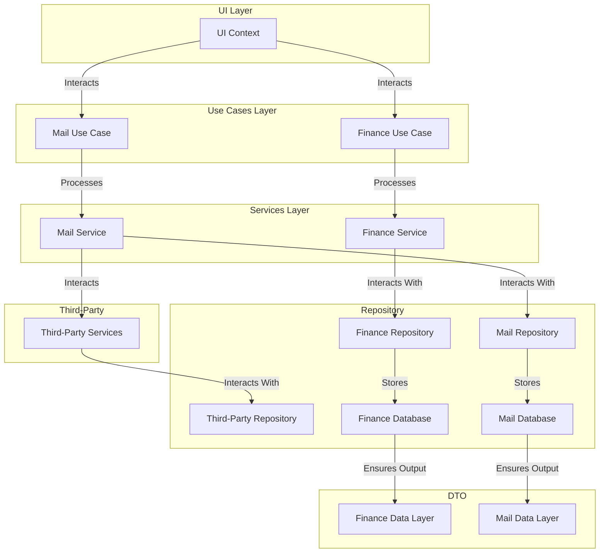

# Application Architecture Guide

## 1. Overview

The application follows a structured layered architecture, ensuring clear separation of concerns:



## 2. Layer Responsibilities

### 2.1 UI Layer
- **Components**: UI Context
- **Responsibilities**:
  - Handles user interactions.
  - Delegates business logic to the Use Case layer.

### 2.2 Use Cases Layer
- **Components**: Finance Use Case, Mail Use Case
- **Responsibilities**:
  - Manages business logic for finance and mail operations.
  - Orchestrates service calls and workflows.

#### Laravel Example:
```php
namespace App\UseCases;

use App\Services\FinanceService;

class FinanceUseCase {
    protected $financeService;
    
    public function __construct(FinanceService $financeService) {
        $this->financeService = $financeService;
    }
    
    public function execute(array $data) {
        return $this->financeService->processTransaction($data);
    }
}
```

### 2.3 Services Layer
- **Components**: Finance Service, Mail Service
- **Responsibilities**:
  - Implements domain logic for financial and mail processing.
  - Provides reusable business services.

#### Laravel Example:
```php
namespace App\Services;

use App\Repositories\FinanceRepository;

class FinanceService {
    protected $financeRepository;
    
    public function __construct(FinanceRepository $financeRepository) {
        $this->financeRepository = $financeRepository;
    }
    
    public function processTransaction(array $data) {
        return $this->financeRepository->storeTransaction($data);
    }
}
```

### 2.4 Third-Party Layer
- **Components**: Third-Party Services
- **Responsibilities**:
  - Interfaces with external systems such as payment gateways and email providers.
  - Handles third-party API communication.

#### Laravel Example:
```php
namespace App\ThirdParty;

use Illuminate\Support\Facades\Http;

class PaymentGateway {
    public function charge(array $data) {
        return Http::post('https://api.paymentprovider.com/charge', $data);
    }
}
```

### 2.5 Repository Layer
- **Components**: Finance Repository, Mail Repository, Third-Party Repository
- **Responsibilities**:
  - Manages data persistence and retrieval.
  - Interacts with databases and external repositories.

#### Laravel Example:
```php
namespace App\Repositories;

use App\Models\Finance;

class FinanceRepository {
    public function storeTransaction(array $data) {
        return Finance::create($data);
    }
}
```

### 2.6 DTO (Data Transfer Object) Layer
- **Components**: Finance Data Layer, Mail Data Layer
- **Responsibilities**:
  - Ensures structured data flow between repositories and services.
  - Encapsulates data transformation logic.

#### Laravel Example:
```php
namespace App\DTO;

class FinanceDTO {
    public string $amount;
    public string $currency;
    
    public function __construct(string $amount, string $currency) {
        $this->amount = $amount;
        $this->currency = $currency;
    }
    
    public static function fromArray(array $data): self {
        return new self($data['amount'], $data['currency']);
    }
}
```

## 3. Simple CRUD with Filament vs. Complex Architecture

### 3.1 Simple CRUD with Filament
- **Use Case**: Basic CRUD operations (Create, Read, Update, Delete) without complex business logic.
- **Example**:
```php
class UserResource extends Resource {
    public static function form(Form $form): Form {
        return $form->schema([
            TextInput::make('name')->required(),
            TextInput::make('email')->email()->required(),
        ]);
    }
    
    public static function table(Table $table): Table {
        return $table->columns([
            TextColumn::make('name'),
            TextColumn::make('email')
        ]);
    }
}
```

### 3.2 Complex Architecture
- **Use Case**: When multiple layers of business logic, external integrations, or state management are needed.
- **Example**: A user approval process requiring workflow automation, event handling, and external API communication.
- **When to Use**:
  - Complex business rules.
  - Multiple services interacting.
  - Approval workflows.
  - High-security or compliance requirements.
  - Advanced state management and caching.

## 4. Summary
This architecture ensures modularity, scalability, and maintainability. By keeping clear boundaries between layers, the system remains extensible and easier to debug and evolve.

